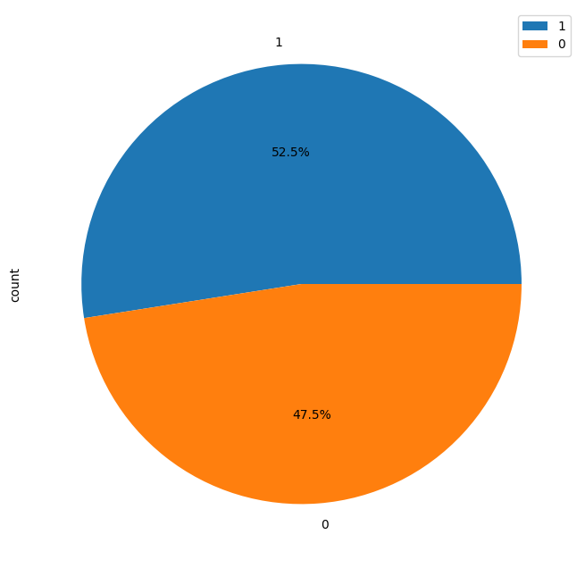
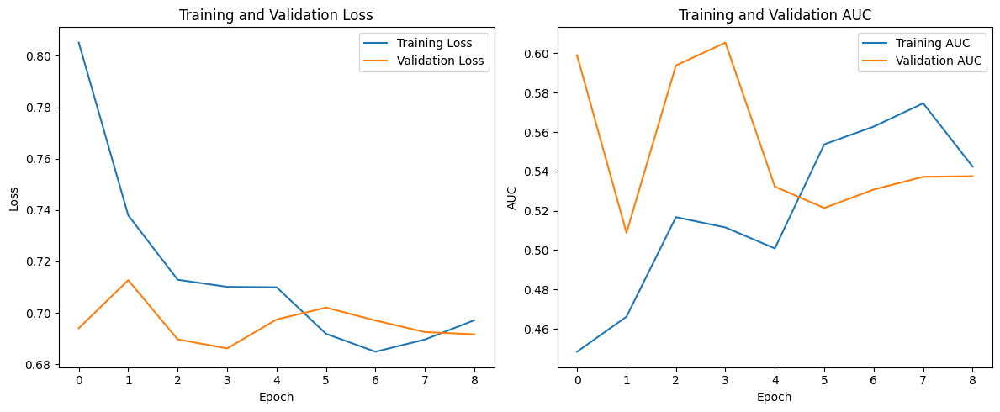
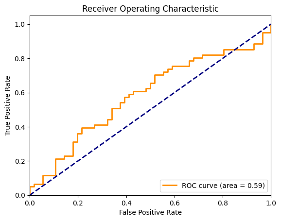
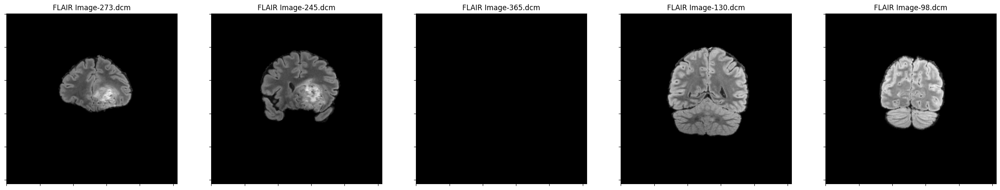
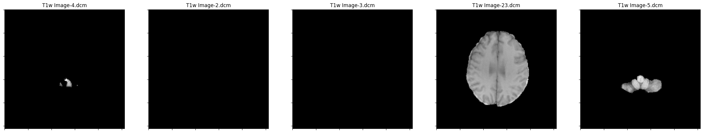
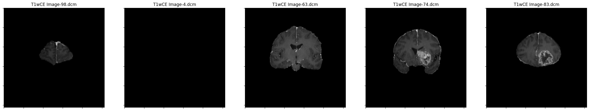
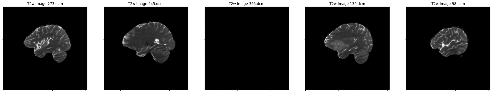

[](README.fr.md)
[]


# Radiogenomics Analytics Framework

**MRI → Radiomics / 3D CNN → Genomic Prediction (MGMT Methylation)**

  

Two complementary approaches to predict **MGMT promoter methylation status**
in glioblastoma from multi-modal MRI — non-invasively, without biopsy. Built on
the [RSNA-MICCAI Brain Tumor Radiogenomic
Classification](https://www.kaggle.com/competitions/rsna-miccai-brain-tumor-radiogenomic-classification)
dataset.

> **What is radiogenomics?** An interdisciplinary field studying the statistical
> associations between quantitative imaging features (**radiomics**) and the
> genomic/molecular characteristics of tumors. MGMT promoter methylation is a key
> prognostic biomarker: methylated tumors respond better to temozolomide
> chemotherapy.

## Key Results (3D CNN)

> Predicting MGMT from MRI alone is famously hard — most models in the
> literature stay near chance level (AUC 0.50–0.65).

| Metric | Value |
|---|---|
| **Test AUC — ensemble of 5 models** | **≈ 0.64** |
| Cross-validated AUC (5-fold, honest level) | 0.61 ± 0.04 |
| Balanced accuracy (ensemble) | ≈ 0.60 |

Methodology kept honest throughout: decision threshold tuned on validation
only, test evaluated once, and cross-validation as the reliable estimate.
A documented negative result (multi-modal stacking *degrades* performance due
to unaligned modalities) and class weighting/threshold/augmentation ablations
are included in the notebook.

### Class balance & training behaviour

| | |
|:---:|:---:|
|  |  |
| *Class distribution — near-balanced (52.5% / 47.5%)* | *Loss & AUC across epochs — no severe overfitting* |

| | |
|:---:|:---:|
|  | |

*Single-model ROC (AUC 0.59) — the ensemble of 5 models pushes the test AUC
to ≈ 0.64.*

---

### The four MRI modalities

Sample slices from a single patient, as loaded from DICOM in the notebook:

| FLAIR | T1w |
|:---:|:---:|
|  |  |
| **T1wCE** (ring-enhancing tumor visible) | **T2w** |
|  |  |

*T1wCE highlights the ring-enhancing lesion typical of high-grade glioma —
the target of the prediction task.*

---

## Table of Contents

- [Pipeline](#pipeline)
- [Methodology](#methodology)
- [Project Structure](#project-structure)
- [Installation](#installation)
- [Running the Notebook](#running-the-notebook)
- [Outputs](#outputs)
- [Medical Disclaimer](#medical-disclaimer)

---

## Pipeline

The notebook (`radiogenomics-research.ipynb`) is organized into 10 sequential
sections:

| Section | Step | Description |
|---|---|---|
| A | Setup & Installation | Environment configuration (all libraries available on Kaggle). |
| B | Data Understanding | Clinical labels, class balance inspection, MRI modality overview. |
| C | Image Preprocessing | Robust pipeline for multi-modal MRI (FLAIR / T1 / T1ce / T2). |
| D | Tumor Region Approximation | Pseudo-ROI construction (real segmentation masks are unavailable). |
| E | Radiomics Feature Extraction | Three categories of quantitative imaging descriptors. |
| F | Feature Selection | High-dimensional space reduction + LASSO, consensus feature set. |
| G | **Radiogenomic Analysis** | Statistical association testing, multi-modality fusion analysis, biological plausibility of markers. |
| H | Predictive Modeling | Logistic Regression vs Random Forest, before/after feature selection, 5-fold stratified CV (no leakage). |
| I | Evaluation | ROC curves, confusion matrices, detailed metrics on the best model. |
| J | Interpretation | Feature importance & biological relevance dashboard. |

## Methodology

- **No data leakage**: all model comparisons use 5-fold stratified
  cross-validation.
- **Honest ROI handling**: real radiomics requires tumor segmentation; since
  masks are unavailable, a documented pseudo-ROI approximation is used instead.
- **Fusion analysis**: quantifies whether combining MRI sequences improves
  prediction over single sequences.
- **Interpretable models first**: Logistic Regression as baseline, Random Forest
  for non-linear interactions — with feature importance for biological review.

## Project Structure

```text
.
├── jaouad-el-morabit.ipynb        # 3D CNN approach — professor's assignment (EXECUTED, results included)
├── radiogenomics-research.ipynb   # Radiomics + classical ML framework (sections A–J)
├── Jaouad_El_Morabit.pdf          # Project report (French)
├── requirements.txt               # Python dependencies
└── .gitignore
```

## The Two Notebooks

### 1. `jaouad-el-morabit.ipynb` — 3D CNN (executed ✅)

> **Provenance:** developed from the assignment notebook provided by the
> professor, [**BIAM TP02**](https://www.kaggle.com/code/hichamamakdouf/biam-tp02)
> (by H. AMAKDOUF, itself based on a public competition kernel).

Complete deep-learning pipeline in 18 sections: DICOM loading → 3D volumes →
3D CNN → evaluation, with 5 optimizations tested one by one (class weighting,
threshold tuning, best-slices + z-score normalization, data augmentation,
5-fold cross-validation) plus two final levers (multi-modality fusion,
ensembling). All cells executed on Kaggle with outputs and figures embedded.
Also viewable on [Kaggle](https://www.kaggle.com/code/jaouadelmorabit/jaouad-el-morabit).

### 2. `radiogenomics-research.ipynb` — Radiomics framework

> **Provenance:** original competition notebook, available on
> [Kaggle](https://www.kaggle.com/code/jaouadelmorabit/radiogenomics-research).

The alternative interpretable approach (sections A–J described below). This
is the notebook source; run it once against the dataset to regenerate outputs.

### Radiomics pipeline detail

## Installation

Requirements: **Python ≥ 3.10** with pip.

```bash
git clone https://github.com/jawadelMorabit-smi/radiogenomics-analytics-framework.git
cd radiogenomics-analytics-framework
pip install -r requirements.txt
jupyter notebook radiogenomics-research.ipynb
```

Dependencies: NumPy, pandas, SciPy, scikit-learn, statsmodels, OpenCV,
scikit-image, PyDICOM, Matplotlib, seaborn.

## Running the Notebook

The pipeline was developed for the **Kaggle environment**, where the RSNA-MICCAI
dataset is mounted at `/kaggle/input`. Two options:

1. **Recommended — Kaggle:** open the notebook at
   [kaggle.com/code](https://www.kaggle.com/code), attach the competition
   dataset, and *Run All*. Free GPU/CPU quota is sufficient.
2. **Locally:** download the RSNA-MICCAI data from Kaggle and update `BASE_PATH`
   in Section B to point to your local copy.

> Note: this repository contains the notebook **source without pre-computed
> outputs** — run it once against the dataset to regenerate all tables and
> figures.

## Outputs

The final section saves 10 figures covering the whole analysis:
class distribution, MRI modalities, preprocessing steps, ROI approximation,
feature selection, radiogenomic association (volcano plot), modality fusion,
model comparison, evaluation (ROC/confusion matrix), and an interpretation
dashboard.

The executed CNN notebook additionally embeds 7 figures (training curves,
ROC, confusion matrices) and its full run is viewable on
[Kaggle](https://www.kaggle.com/code/jaouadelmorabit/jaouad-el-morabit).

## Medical Disclaimer

This project is a **research/educational framework**. It is not a medical
device and must not be used for clinical decision-making.

---

*Author: Jaouad El Morabit — Master BIAM 2025-2026, Biomedical Imaging.*
